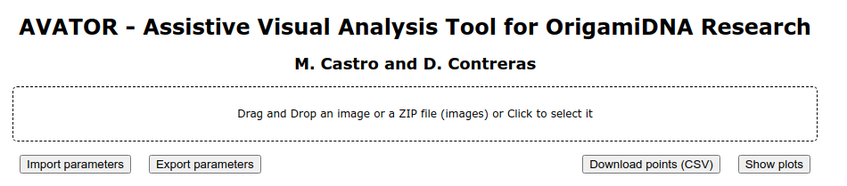
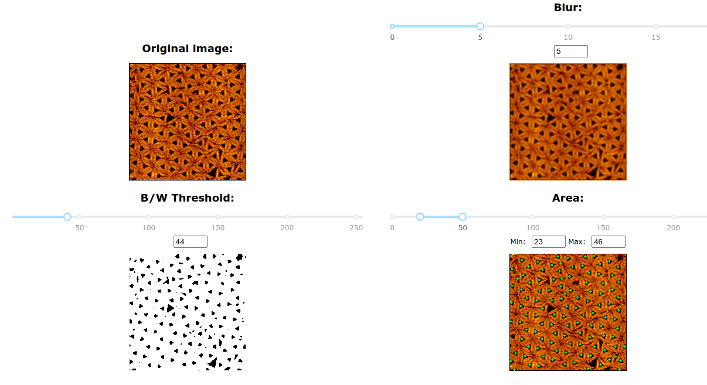
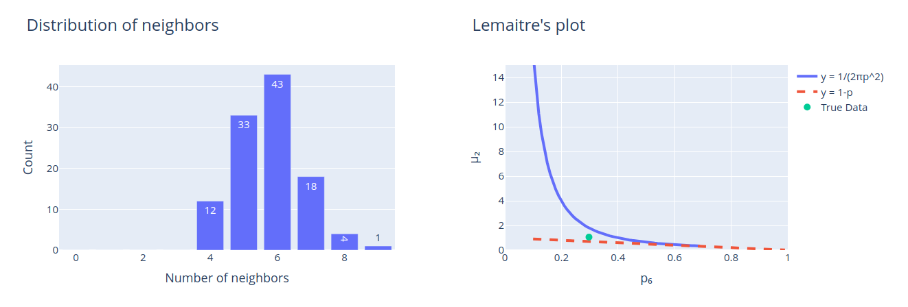
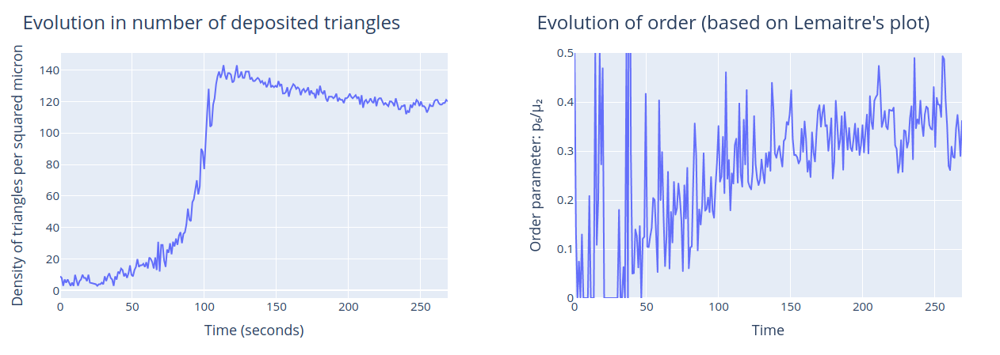

# Origami analysis web tool
Simple web app to analize origami-DNA triangular structures.

## Installation
Download/clone the repository and run
```
python -m pip install -r requirements.txt
```
so all the python dependencies are installed.

If this does not work out of the box, create first a virtual environment and then reinstall.
```
python -m venv origami_environment
```
this will create a folder called origami_environment and, inside, you'll find the binaries to activate this environment (depending on your OS and shell).

## Screenshots

### Upload png (single image) or zip file (many png's)
In the case of zip files, they should be named as `save-YYYY.MM.dd-hh.mm.ss.sss.png`


You can also export/import parameters in json format.

After the upload you can either `Download points (CSV)` or `Show plots`

### For single images, fine tune the parameters
Move the levers to fine tune the origami detection.


### Plots for single images


### Plots for zip files

